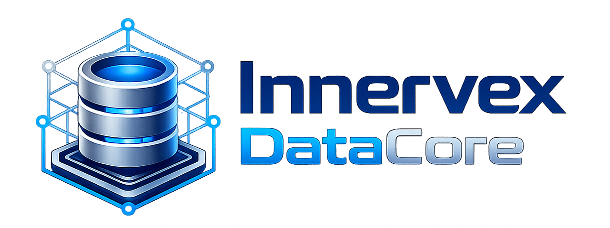

# Innervex DataCore

Enterprise-grade embedded relational database technology for Java platforms,
based on Apache Derby.

Innervex DataCore is an independent open-source continuation and modernization
workspace derived from Apache Derby 10.17.1.0. The project keeps Derby's proven
embedded relational database foundation while creating room for focused
enterprise maintenance, usability improvements, and Java platform evolution.

This project is developed and maintained by Innervex Technologies Private
Limited as part of the Innervex enterprise data platform work.

## Public Project Notice

Innervex DataCore is an independent project based on Apache Derby. It is not an
official Apache Derby release and is not affiliated with, endorsed by, or
maintained by the Apache Software Foundation.

Innervex and Innervex DataCore branding belong to Innervex Technologies Private
Limited.

Apache Derby source attribution, copyright notices, license terms, and NOTICE
content are preserved. New Innervex DataCore changes are developed in this
repository under the same Apache License, Version 2.0.

## Project Status

This repository begins from the Apache Derby source distribution. The original
Apache licensing, notices, and source attribution are preserved in `LICENSE`,
`NOTICE`, and `README`.

For a contributor-oriented map of the codebase, see
[`docs/ARCHITECTURE.md`](docs/ARCHITECTURE.md).

## Build

The primary build remains Ant-based:

```sh
ant -quiet clobber buildsource buildjars
```

The main generated product jars are created under `jars/sane/`.

`sane` is Derby's development build flavor. It keeps Derby sanity checks
enabled so internal problems are easier to catch while working on the engine.

## NetBeans

Open the repository root directly in NetBeans:

```text
/Users/sureshn/Projects/db-derby-10/innervex-datacore
```

The root `nbproject` metadata exposes the main source modules and delegates
build actions to the top-level Ant `build.xml`.

Recommended local setup:

- JDK 21 or newer
- Ant 1.10.14 or newer
- Trust the project build script when NetBeans prompts

Build outputs such as `classes/`, `generated/`, `jars/`, and
`changenumber.properties` are local artifacts and are ignored by Git.

## Contributing

Contributions are welcome. Please keep changes small, focused, and compatible
with the existing Derby behavior unless a change is clearly documented as a
planned modernization.

For private vulnerability reporting, see [`SECURITY.md`](SECURITY.md).

Good first areas:

- Build and IDE cleanup
- Documentation improvements
- Tests and small bug fixes
- Benchmarking and performance measurement
- Locking, storage, and query-planning analysis

Before changing transaction, locking, storage, or SQL execution behavior, add or
identify tests that prove compatibility.

## Source Layout

- `java/org.apache.derby.engine` - core database engine
- `java/org.apache.derby.client` - network JDBC client
- `java/org.apache.derby.server` - network server
- `java/org.apache.derby.tools` - command-line and utility tools
- `java/org.apache.derby.commons` - shared support code
- `java/org.apache.derby.optionaltools` - optional Lucene, JSON, and dump tools
- `java/org.apache.derby.runner` - launcher support
- `java/org.apache.derby.tests` - Derby test suite

## License

Innervex DataCore is based on Apache Derby and is distributed under the Apache
License, Version 2.0. See `LICENSE` and `NOTICE` for details.
